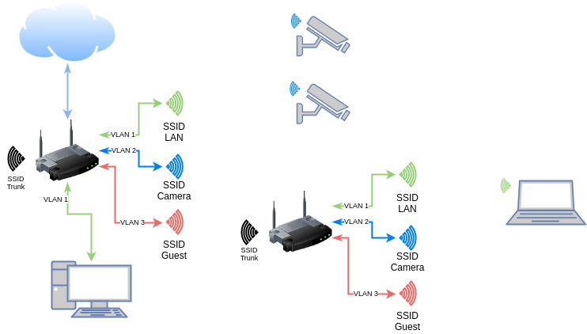

# GRE Layer 2 Tunnel over Wi-Fi with OpenWrt

OpenWrt UCI config (relevant sections) for configuring a layer 2 GRE tunnel over a point-to-point Wi-Fi link

Fig. 1: diagram

Refer to blog post for more info: https://badgateway.qc.to/vlans-and-wifi

